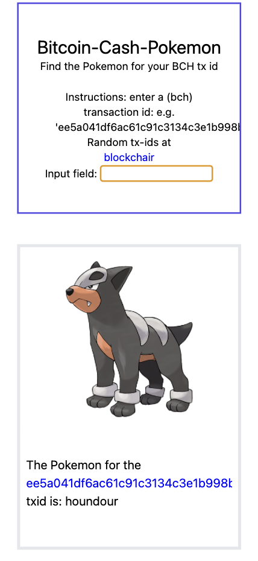

# bitcoin cash pokemon

> find the ?Pokemon for a bch tx id

[Demo](https://adnjoo.github.io/bitcoin-cash-pokemon/)

It should be a 64 character long hexadecimal. The hexadecimal -> decimal conversion should output a number between 771947261582107969490473233391252719021799897770937093596383893386087530932 and 115792089237316195423570985008687907853269984665640564039457584007913129639935
